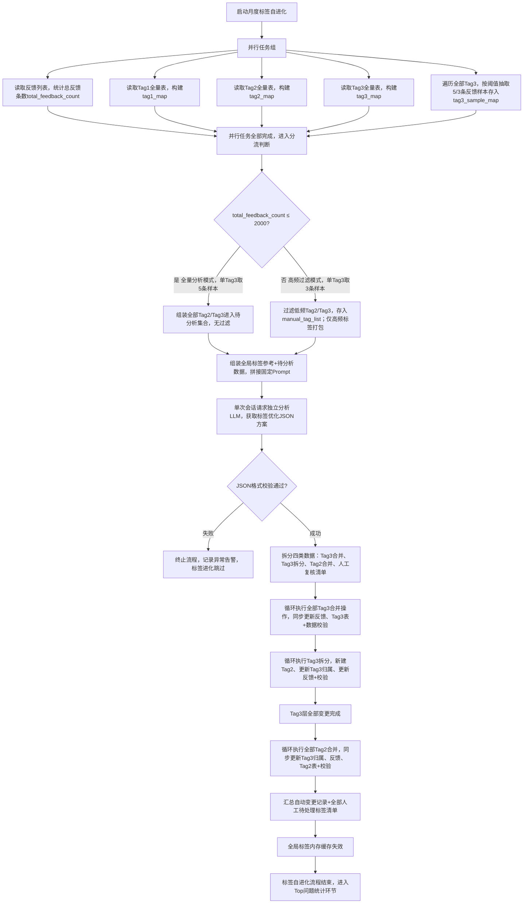

# NPS Insight 标签自进化完整开发说明书（更新：小数据模式Tag3取5条反馈样本）
## 前置基础说明
1. 数据来源均为飞书多维表格；
2. 总反馈阈值：2000条，自动分流两种模式；
3. 两套AI分离：编码AI写本段程序，独立LLM做标签语义分析；
4. 可并行任务标注【并行执行】，串行步骤顺序固定；
5. 用户反馈单条几十字以内，无需截断；
6. 执行强制顺序：先处理全部Tag3合并/拆分 → 再处理全部Tag2合并；
7. AI仅输出固定JSON，模糊无法判定标签全部走人工复核，系统不自动改表；
8. **更新调整**：小数据模式（总反馈≤2000）每个Tag3抽取5条反馈样本；大数据高频过滤模式维持3条样本不变。

# 一、全量数据来源定义（编码AI明确读取哪张表）
## 1. 总反馈数量来源
数据表：**反馈列表**
读取逻辑：统计本表总行数，得到全局总反馈条数 `total_feedback_count`，用于分流判断。

## 2. Tag体系数据来源
1. Tag3表：tagId、标签名称、定义说明、所属二级标签（关联Tag2）、总使用次数、大租户使用次数
2. Tag2表：tagId、标签名称、定义说明、所属一级标签（关联Tag1）、总使用次数
3. Tag1表：tagId、tagId、标签名称、定义说明
【并行执行】同时拉取Tag1、Tag2、Tag3三张表全量数据，存入内存字典。

## 3. 标签配套反馈样本来源
数据表：**反馈列表**
关联逻辑：每条反馈关联Tag1/Tag2/Tag3；
分流抽取规则：
- 分支1（total_feedback_count ≤ 2000 全量模式）：每条Tag3随机抽取**5条**绑定该Tag3的反馈原文作为参考样本；
- 分支2（total_feedback_count > 2000 高频过滤模式）：每条Tag3随机抽取**3条**绑定该Tag3的反馈原文作为参考样本。

## 4. Top问题表（本阶段不参与标签进化，仅进化完成后生成）

# 二、前置并行数据处理逻辑（全部并行执行，互不阻塞）
任务组【并行执行】
任务1：读取反馈列表，统计 `total_feedback_count`
任务2：读取Tag1全量数据，构建字典 `tag1_map<tagId, 完整信息>`
任务3：读取Tag2全量数据，构建字典 `tag2_map<tagId, 完整信息>`
任务4：读取Tag3全量数据，构建字典 `tag3_map<tagId, 完整信息>`
任务5：遍历所有Tag3，根据分流阈值批量关联反馈列表，缓存对应数量反馈样本
    - 若`total_feedback_count ≤ 2000`：`tag3_sample_map<tag3Id, [反馈文本1,反馈文本2,反馈文本3,反馈文本4,反馈文本5]>`
    - 若`total_feedback_count > 2000`：`tag3_sample_map<tag3Id, [反馈文本1,反馈文本2,反馈文本3]>`

并行全部完成后，进入分流判断。

# 三、分流判断逻辑（串行，二选一）
## 分流阈值：total_feedback_count ≤ 2000
### 分支1：小数据模式（全量分析模式）
1. 筛选规则：**不做任何过滤**，所有Tag2、Tag3全部参与AI分析
2. 待分析集合组装：
   - all_tag3_list：内存全部Tag3，每条携带tagId、名称、定义、归属Tag2、使用次数、**5条反馈样本**
   - all_tag2_list：内存全部Tag2，每条携带tagId、名称、定义、下属全部Tag3ID集合、总反馈数

### 分支2：大数据模式（高频过滤模式，total_feedback_count > 2000）
1. Tag3过滤规则：Tag3总使用次数 ≥5 才进入分析集合；低于5次存入人工待处理清单，不发给AI
2. Tag2过滤规则：Tag2总使用次数 ≥10 才参与Tag2合并分析；低于10次仅内部Tag3参与分析，不参与Tag2合并
3. 组装集合：
   - high_freq_tag3_list：过滤后高频Tag3，附带名称、定义、归属Tag2、使用次数、**3条反馈样本**
   - high_freq_tag2_list：过滤后高频Tag2，附带名称、定义、下属全部高频Tag3ID、总反馈数
4. 人工缓存列表 `manual_tag_list`：存储所有被过滤掉的低频Tag2/Tag3，后续写入月报

# 四、打包入参 + 标准Prompt（直接复制给LLM，固定不可修改）
## 1. 打包发给AI的完整入参结构
```json
{
  "global_tag_reference": {
    "tag1": [全部Tag1精简信息：tagId,名称,定义],
    "tag2": [全部Tag2精简信息：tagId,名称,定义],
    "tag3": [全部Tag3精简信息：tagId,名称,定义]
  },
  "analysis_data": {
    "tag3_list": 分支生成的待分析Tag3集合,
    "tag2_list": 分支生成的待分析Tag2集合
  },
  "mode": "全量分析模式 / 高频过滤模式"
}
```

## 2. 固定Prompt（拼接在入参前发给LLM）
```
# 硬性执行规则（严格遵守，不可颠倒顺序）
1. 处理顺序强制：第一步处理所有Tag3（合并同义Tag3、对单Tag2下Tag3≥10的分组拆分生成新Tag2）；所有Tag3优化完毕后，第二步再处理全局Tag2合并；禁止颠倒顺序。
2. Tag3合并规则：全局任意两个Tag3语义高度一致，无论归属哪个Tag2都需要合并；保留使用次数更高的标签为主标签。
3. Tag3拆分规则：单个父Tag2下属Tag3总数≥10，且配套用户反馈能清晰分为2~3类独立业务场景，才生成新Tag2，分配对应Tag3；无法清晰分类则放入人工复核。
4. Tag2合并规则：仅在全部Tag3处理完成后执行；整体业务场景高度重合的不同Tag2执行合并，保留使用频次更高Tag2。
5. 参考素材：每条标签附带多条用户反馈原文（每条几十字），判断相似度必须结合反馈语义，不能仅依靠标签文字。
6. 模糊判定规则：标签相似度中等、场景边界模糊、无法100%确定合并/拆分的标签，全部放入manual_review，禁止自动生成优化方案。
7. 输出约束：只返回纯JSON字符串，无任何解释、无markdown、无多余文字，严格遵循下方固定输出结构。

# 固定输出结构
{
  "tag3_opt_result": {
    "merge_tag3": [{"merge_group":["tag3Id1","tag3Id2"],"retain_tag_id":"主tag3Id","reason":"合并依据描述"}],
    "split_tag3_to_new_tag2": [{"origin_tag2_id":"原tag2Id","new_tag2_list":[{"new_tag2_name":"新模块名","bind_tag3_ids":["tag3Id列表"]}]}]
  },
  "tag2_opt_result": {
    "merge_tag2": [{"merge_group":["tag2Id1","tag2Id2"],"retain_tag_id":"主tag2Id","reason":"合并依据描述"}]
  },
  "manual_review": ["标签ID组合+模糊原因，交由人工处理"]
}
```

# 五、接收AI返回结果后系统串行处理步骤
## 步骤1：校验AI返回JSON
1. 校验字段完整：tag3_opt_result、tag2_opt_result、manual_review 全部存在
2. 格式错误：终止标签进化，记录异常日志，推送管理员告警
3. 格式正常：拆分三块数据：tag3合并清单、tag3拆分清单、tag2合并清单、人工复核清单

## 步骤2：优先执行Tag3层全部变更（串行，不可跳过）
### 2.1 执行Tag3合并
循环每一组合并：
1. 主标签：retain_tag_id，废弃其余tag3Id
2. 全量遍历【反馈列表】，批量更新所有废弃Tag3关联为保留Tag3
3. 更新Tag3多维表格：删除废弃Tag3行，刷新主Tag3使用次数、大租户占比公式
4. 数据校验：合并前总绑定反馈数 = 合并后主标签反馈数；不一致阻断执行，移入人工清单

### 2.2 执行Tag3拆分生成新Tag2
循环每一条原Tag2拆分方案：
1. 循环new_tag2_list，在Tag2表新建Tag2记录，自动生成唯一tagId
2. 批量更新对应Tag3表内「所属二级标签」关联为新tag2Id
3. 全量遍历反馈列表，同步更新反馈内Tag2关联为新Tag2
4. 数据校验：原Tag2下所有Tag3全部分配至新旧Tag2，无遗漏游离标签；校验失败阻断执行

## 步骤3：Tag3全部处理完成后，执行Tag2合并（串行）
循环每一组Tag2合并：
1. 保留retain_tag_id为主Tag2，废弃其他tag2Id
2. 批量更新Tag3表内「所属二级标签」全部替换为主Tag2
3. 批量更新反馈列表中废弃Tag2关联为主Tag2
4. Tag2多维表格删除废弃行，刷新统计字段
5. 数值校验：合并前后关联反馈总数一致，不一致阻断

## 步骤4：汇总全部变更记录
1. 自动变更统计：合并Tag3数量、拆分新增Tag2数量、合并Tag2数量
2. 人工待处理合集：AI返回manual_review + 大数据模式过滤的低频标签manual_tag_list
3. 存储变更日志内存，用于后续写入月度月报文档

# 六、标签自进化完成后后置流程
1. 清空本次内存所有Tag缓存，强制5分钟标签缓存失效
2. 进入月度分析下一环：按Tag2+Tag3组合统计反馈生成Top问题表

# 七、Mermaid完整流程图（无改动，仅内部样本抽取逻辑更新）


# 八、标签自进化节点验收表（更新样本数量校验项）
| 节点编号 | 节点名称 | 输入数据源 | 程序输出 | 详细验证标准 |
| ---- | ---- | ---- | ---- | ---- |
| 1 | 并行读取反馈统计 | 反馈列表多维表 | total_feedback_count全局反馈总数 | 1. 精准统计表格全部有效反馈行数，无遗漏<br>2. 无数据时返回0，不报错 |
| 2 | 并行读取三层标签表 | Tag1、Tag2、Tag3多维表 | tag1_map、tag2_map、tag3_map内存字典 | 1. 完整读取所有标签字段：tagId、名称、定义、关联关系<br>2. 字典key为tagId，可快速索引，无重复主键 |
| 3 | 并行拉取Tag3反馈样本 | Tag3字典 + 反馈列表 + total_feedback_count阈值 | tag3_sample_map：每个Tag3绑定对应数量反馈原文 | 1. total_feedback_count ≤2000：每条Tag3固定抽取5条真实绑定反馈<br>2. total_feedback_count＞2000：每条Tag3固定抽取3条真实绑定反馈<br>3. 文本完整不截断；无绑定反馈的Tag3标记样本为空数组 |
| 4 | 分流模式判断 | total_feedback_count、全部标签集合 | 待分析tag2/tag3列表、manual_tag_list低频缓存 | 1. ≤2000：所有标签全部进入待分析集合，manual_tag_list为空<br>2. ＞2000：Tag3使用＜5、Tag2使用＜10全部移入人工清单，不参与AI分析<br>3. 两种分支数据无重复、无丢失 |
| 5 | AI入参打包+Prompt拼接 | 全局标签参考、待分析标签集合、模式标识 | 完整LLM请求体（固定Prompt+业务JSON） | 1. Prompt文本完全固定，不动态修改约束规则<br>2. 全局标签参考包含全部三层标签，约束AI不乱生成新标签<br>3. 区分模式字段传给AI用于辅助判断 |
| 6 | 调用独立语义LLM分析 | 完整请求体 | 标准结构化JSON优化方案 | 1. 单次会话完成，不拆分多轮调用<br>2. 接口超时、报错捕获，终止进化并推送告警 |
| 7 | AI返回JSON格式校验 | LLM返回文本 | 结构化拆分四组数据 | 1. 缺失任一顶级字段判定格式失败<br>2. 数组字段类型错误直接阻断执行，不操作表格 |
| 8 | 执行Tag3批量合并 | Tag3合并清单、反馈列表、Tag3表 | 更新后的反馈关联、Tag3多维表 | 1. 废弃Tag3所有绑定反馈全部切换为主标签<br>2. 合并前后反馈总条数完全相等，数值不一致阻断更新<br>3. 废弃Tag3从Tag3表删除，主标签统计字段自动刷新 |
| 9 | 执行Tag3拆分新建Tag2 | Tag3拆分清单、Tag2表、Tag3表、反馈列表 | 新增Tag2记录、更新Tag3归属、更新反馈Tag2关联 | 1. 自动生成唯一tagId写入Tag2表<br>2. 原Tag2下所有Tag3全部分配至新旧Tag2，无游离<br>3. 所有反馈内对应Tag2同步替换，无遗漏 |
| 10 | 执行Tag2批量合并 | Tag2合并清单、Tag2表、Tag3表、反馈列表 | 更新Tag3归属、反馈关联、Tag2表 | 1. 废弃Tag2下全部Tag3切换归属为主Tag2<br>2. 全量反馈Tag2关联同步更新<br>3. 数值校验通过才执行入库，失败移入人工清单 |
| 11 | 变更数据汇总 | 全部变更操作日志、AI人工清单、低频过滤清单 | 统一人工待处理总清单、变更统计数字 | 1. 自动变更计数准确：合并Tag3、新增Tag2、合并Tag2数量<br>2. 人工清单合并AI模糊标签+低频过滤标签，无重复 |
| 12 | 标签缓存失效 | 内存标签缓存 | 缓存标记失效 | 1. 全局5分钟标签内存缓存清空，下次周打标重新拉取最新标签 |
| 13 | 流程收尾校验 | 全流程执行日志 | 标签自进化执行完成标识 | 1. 无报错正常走完所有节点，标记执行成功<br>2. 中途阻断生成异常日志，不进入下一环节Top问题统计 |
