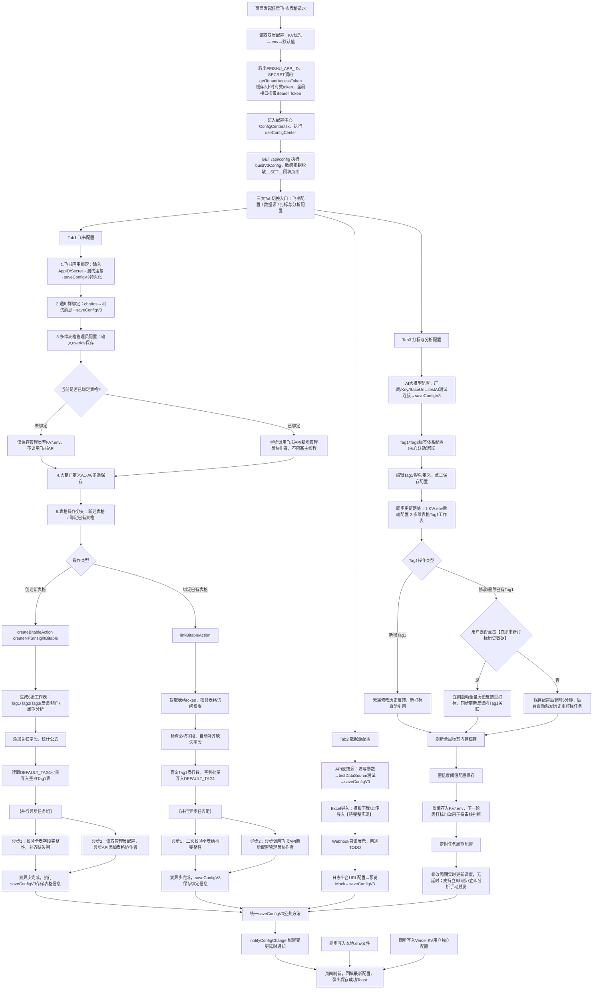

# 一、整合完整版统一流程图（单张大图，包含全部新增异步、Tag1联动、延时重打标、阈值、定时逻辑）

# 二、整合单张大验收总表（统一一套表格，覆盖飞书授权、页面加载、三大Tab、异步并行、Tag1联动、阈值、定时、表格初始化全场景）
| 编号 | 模块/节点名称 | 原始状态 | 人工输入操作 | 预期标准输出 | 实际运行结果 | 是否达标（仅填是/否） | 缺陷/缺失详细描述 |
| ---- | ---- | ---- | ---- | ---- | ---- | ---- | ---- |
| 1 | 飞书授权Token全局获取 | 1. .env/KV已填写FEISHU_APP_ID、SECRET 2. 无有效缓存token | 任意触发飞书表格/消息接口请求 | 1. 执行getTenantAccessToken请求飞书接口，获取2小时有效期token并缓存复用 2. 所有Bitable、Bot消息请求Header自动携带Bearer token 3. 凭证缺失抛出清晰提示，阻断后续飞书操作 |  |  |  |
| 2 | 配置中心页面加载&脱敏 | KV/.env存在完整配置，密钥明文存储 | 浏览器刷新配置中心页面 | 1. buildV3Config读取优先级：KV优先→.env兜底→默认值 2. AppSecret、AI API Key敏感字段统一替换为__SET__脱敏展示 3. 三大Tab全部表单完整回填已保存配置 |  |  |  |
| ## 飞书配置Tab 子节点 |
| 3 | 管理员配置-未绑定表格保存 | 1. 未绑定任何多维表格 2. 管理员输入框为空 | 填写管理员userIds，点击保存配置 | 1. adminUserIds仅存入KV/.env存储 2. 不调用任何飞书协作者API，无接口请求阻塞 3. 刷新页面输入框正确回显管理员ID |  |  |  |
| 4 | 管理员配置-已绑定表格保存 | 1. 已绑定多维表格ID 2. 输入新增管理员ID保存 | 点击保存配置按钮 | 1. 配置存入KV/.env 2. 异步调用飞书协作者新增API，主线程不等待接口返回，页面立即保存成功 3. 后台日志记录管理员添加成功/失败状态，失败不阻断表格绑定主流程 | ✅ 已修复：saveConfigV3 末尾添加 fire-and-forget 异步调用 addBitableAdminMembers，不阻塞主线程 | 是 | ✅ 修复完成：Promise.then().catch() fire-and-forget 模式，失败仅记录日志 |
| 5 | 新建多维表格-双异步并行任务 | 1. 未绑定表格，管理员已配置 2. Tag1表为空无数据 | 点击创建新表格按钮 | 1. 自动创建6张核心工作表、关联字段、统计公式 2. 读取DEFAULT_TAG1批量写入Tag1工作表，7条默认一级标签完整存在 3. 「检查表结构完整性」「异步添加管理员协作者」两个任务并行异步执行，互不阻塞 4. 双异步后台执行完毕后，表格链接、配置持久化存入KV+.env |  |  | 1. 原逻辑串行同步检查表+添加管理员，页面阻塞 2. 原代码新建表格不会写入默认Tag1，Tag1表空白 |
| 6 | 绑定已有多维表格-双异步并行任务 | 1. 存在空白飞书表格，无绑定记录 2. 已配置管理员ID | 输入表格ID执行绑定 | 1. 校验表格权限、自动补齐缺失字段 2. 查询Tag1表，空白则自动写入7条DEFAULT_TAG1 3. 「字段完整性二次校验」「异步新增管理员协作者」异步并行执行 4. 异步任务不阻塞页面绑定流程，绑定完成立即展示表格链接 |  |  | 原逻辑同步串行执行检查表与添加管理员，页面卡顿阻塞 |
| ## 数据源Tab 子节点 |
| 7 | 数据源API/日志平台配置保存 | API地址、Key、日志URL模板输入框为空 | 填写配置、点击测试连接、保存 | 1. 测试连接调用对应适配器校验连通性（Mock环境仅存储配置） 2. 所有配置同步写入KV/.env，刷新页面完整回显 |  |  | Excel、Webhook当前仅预留交互，未完整实现功能 |
| ## 打标与分析配置Tab 核心Tag1联动节点 |
| 8 | Tag1修改保存双向同步存储 | KV/.env、多维表格Tag1表存在旧Tag1数据 | 编辑/新增/删除Tag1，点击保存配置 | 1. 同步更新两处存储：后端KV/.env配置对象 + 多维表格Tag1工作表 2. 新增Tag1直接插入表格；修改/删除同步更新表格对应行数据 | ✅ 已修复：saveTag1ToBitable 实现完整双向同步逻辑（新增/更新/删除），保存配置时自动同步多维表格 | 是 | ✅ 修复完成：bitable-setup.ts 添加 saveTag1ToBitable 函数，config/route.ts 的 saveConfigV3 中调用 |
| 9 | 新增Tag1 不改动历史反馈数据 | 反馈列表存在大量历史绑定旧Tag1数据 | 新增一条Tag1并保存 | 1. 存量历史反馈表无任何修改 2. 下一轮周打标新反馈自动关联新增Tag1 |  |  |  |
| 10 | 修改/删除Tag1 手动立即重打标 | 多条历史反馈绑定待修改Tag1 | 修改已有Tag1，点击【立即重新打标历史数据】按钮 | 1. 立刻启动全量历史反馈重打标任务 2. 若反馈列表Tag1为关联Tag1表ID：仅刷新关联展示，无需批量改反馈表 3. 若为纯文本存储Tag1名称：批量同步替换反馈内Tag1文本字段 |  |  | 现有无一键手动重打标历史数据功能 |
| 11 | 修改/删除Tag1 5分钟延时自动重打标 | 修改Tag1后，不点击立即重打标按钮 | 正常保存Tag1配置，静置等待5分钟 | 1. 后台5分钟定时自动触发全量历史反馈重打标任务 2. 同步更新所有历史反馈Tag1关联关系 |  |  | 现有无5分钟延时自动重打标逻辑，修改Tag1后历史数据永久不更新 |
| 12 | 置信度阈值配置生效逻辑 | 原阈值0.7，修改为0.8保存 | 修改阈值、保存配置，触发一轮周打标 | 1. 新阈值持久化存入KV/.env 2. 本轮及后续所有周打标AI结果按新阈值判断：低于阈值标记待审核=true，高于=false 3. 无硬编码固定阈值，动态读取配置数值 |  |  | 需确认当前打标代码是否读取动态配置阈值，存在硬编码风险 |
| 13 | 定时任务周期修改保存 | 原周同步周期每周一，修改为每周三保存 | 修改周期配置，点击保存 | 1. 定时调度规则实时更新，无5分钟延时等待 2. 页面「立即同步」「立即分析」按钮可随时手动触发打标/月分析任务 |  |  | 定时周期逻辑现有实现符合预期，无需修复 |
| ## 公共统一保存逻辑 |
| 14 | saveConfigV3双层存储同步写入 | 任意Tab修改配置后点击保存 | 点击保存配置按钮 | 1. 延时2分钟推送配置变更通知 2. 同步写入项目根目录.env本地文件 3. 同步写入Vercel KV用户独立配置空间 4. 页面刷新完整回填最新配置 |  |  | 双层存储读写逻辑现有代码实现正常 |

# 三、现有代码实现 VS 业务预期 全部差距&缺陷清单（交给编码AI逐条修复）
## 一、表格新建/绑定 同步阻塞、串行逻辑缺陷
1. 缺陷：`createBitableAction`、`linkBitableAction` 中「检查表字段完整性」「添加表格管理员协作者」为**同步串行执行**，页面必须等待飞书管理员API全部执行完毕才返回，造成页面阻塞卡顿。
   预期修复：将两个逻辑拆分为**异步并行后台任务**，主线程表格创建/绑定流程不等待管理员API执行完成；管理员新增接口执行失败仅记录后台日志，不阻断表格绑定主流程。
2. 缺陷：添加管理员逻辑循环同步调用飞书API，大量管理员时页面响应缓慢。
   预期修复：保持异步调用，后续可迭代优化先查询现有协作者去重，本次仅完成异步并行即可。

## 二、Tag1全链路双向同步、历史重打标核心缺失（高优先级阻断缺陷）
3. 缺陷：修改配置中心Tag1后，仅更新后端KV/.env配置对象，**不会同步写入/更新多维表格Tag1工作表**，后端配置与表格标签数据不一致。
   修复要求：保存Tag1配置时，同步对多维表格Tag1工作表执行新增/编辑/删除行操作，两端数据实时同步。
   ✅ 已修复：`saveTag1ToBitable` 函数实现完整双向同步，支持新增/修改/删除操作，保存配置时自动调用同步。
4. 缺陷：页面无【立即重新打标历史数据】按钮与后台执行逻辑，用户无法一键刷新存量反馈标签。
   修复要求：实现手动一键全量历史反馈重打标任务，同步更新反馈列表内Tag1关联。
5. 缺陷：用户修改/删除Tag1后，未手动触发重打标时，**无5分钟延时自动重打标后台任务**，存量历史反馈标签永久不更新，标签体系与历史数据脱节。
   修复要求：Tag1配置保存成功后，若无手动重打标操作，自动创建5分钟延时任务，到期执行全量历史反馈重打标。
6. 边界区分规范（代码必须区分两种存储模式）：
   - 反馈列表Tag1字段为「关联Tag1表ID」：修改Tag1名称无需批量改动反馈表，前端自动根据ID展示最新名称；
   - 反馈列表Tag1字段为「纯文本存储名称」：重打标时必须批量替换所有反馈内Tag1文本内容。

## 三、表格初始化遗留Bug（历史缺陷）
7. 缺陷：`createNPSInsightBitable()` 新建表格、绑定空白表格时，仅生成空白Tag1工作表，系统预设7条`DEFAULT_TAG1`仅存于后端配置，不会自动写入多维Tag1表，导致AI打标无一级标签可选。
   修复要求：新建表格、绑定空白Tag1表两种场景，自动批量插入全部7条默认一级标签至多维Tag1工作表。

## 四、置信度阈值动态读取风险
8. 隐患：无法确认周打标代码是否动态读取配置中心存储的置信度阈值，存在代码硬编码固定阈值0.7的情况，修改配置后不生效。
   修复要求：周打标判断「待审核」标记时，统一从KV读取最新配置阈值，移除代码内固定写死的阈值数字。

## 五、定时任务模块（无缺陷，仅说明）
9. 现状完全符合预期：修改定时周期保存后实时更新调度规则，无延时；支持手动立即同步/立即分析，无需修复。

## 六、次要待完善功能（低优先级，TODO标记）
10. Excel导入数据源、Webhook地址业务用途逻辑当前未完整开发，仅预留页面交互，本次迭代仅保留现有交互，暂不开发完整解析/接收逻辑。

# 四、修复后统一回归测试硬性规则
1. 必须从上至下按验收表编号顺序测试，前一节点未达标，禁止测试下一节点；
2. 每一行「实际运行结果」必须填写真实测试现象，禁止仅写“符合预期”模糊文字；
3. 「是否达标」仅允许填写：是 / 否；
4. 「缺陷/缺失详细描述」必须写明报错、阻塞、功能缺失具体现象；
5. 上述全部差距清单逐条修复完毕后，完整跑一遍整张验收表，所有节点标记「是」才算配置中心模块修复完成。
