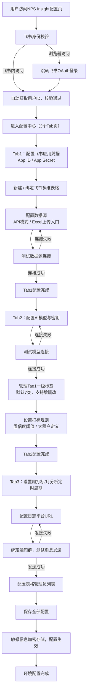

### 1. 环境配置流程图

### 2. 环境配置流程测试
| 节点编号 | 节点名称 | 输入 | 输出 | 验证标准 |
|----------|----------|------|------|----------|
| 1 | 飞书身份校验 | 用户访问请求、飞书用户身份凭证 | 配置中心访问权限 / OAuth跳转链接 | 1. 飞书应用内访问自动识别用户ID，无需登录 2. 浏览器访问正确跳转飞书OAuth授权页 3. 授权后成功获取唯一飞书用户ID |
| 2 | 飞书应用凭据配置 | App ID、App Secret | 凭据加密存储 | 1. 输入框正常接收输入 2. App Secret保存后脱敏显示「已配置」 3. 敏感信息加密存储，明文不可查 |
| 3 | 多维表格新建/绑定 | 表格创建指令 / 已有表格App Token | 绑定成功的多维表格 | 1. 新建表格自动生成6张数据表+仪表盘入口 2. 绑定已有表格可正常读取表结构 3. 表格字段与PRD定义完全一致 |
| 4 | 数据源配置与测试 | API地址、参数模板、时间规则 / Excel文件 | 数据源连接状态 | 1. API模式支持`{{start_unix}}`等时间占位符 2. 时间规则预览显示正确的时间范围 3. 测试连接成功/失败有明确Toast提示 4. Excel上传入口可用，上传后优先级高于API |
| 5 | AI模型配置与测试 | 模型名称、API密钥 | 模型连接状态 | 1. 支持预设模型选择与自定义模型配置 2. 密钥保存后脱敏显示 3. 测试连接可正常返回模型可用状态 |
| 6 | Tag1标签管理 | 标签增删改操作 | Tag1标签列表 | 1. 默认加载7类一级标签，名称与定义正确 2. 支持新增、编辑、删除Tag1标签 3. 修改后标签列表实时同步 |
| 7 | 打标规则配置 | 置信度阈值、大租户定义 | 规则参数存储 | 1. 置信度阈值默认0.8，支持自定义修改 2. 大租户支持多选，默认选中A4/A5/A6 3. 参数保存后下次打标生效 |
| 8 | 定时周期配置 | 周打标Cron、月分析Cron | 定时任务配置 | 1. 支持下拉选择预设周期与自定义Cron 2. 周打标默认每周一09:00，月分析默认每月1日09:00 3. 配置后定时任务准时触发 |
| 9 | 通知群配置与测试 | 飞书群ID | 测试消息发送结果 | 1. 支持配置多个通知群，英文逗号分隔 2. 点击「测试发送」后对应群收到测试卡片 3. 发送失败有明确错误提示 |
| 10 | 管理员配置与保存 | 飞书用户ID列表、全部配置项 | 最终生效的配置文件 | 1. 仅配置所有者可修改管理员列表 2. 点击保存后所有配置项持久化存储 3. 不同用户配置完全隔离，不可互访 |
\
