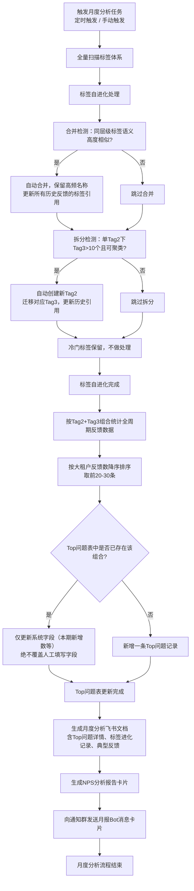

### 1. 月分析流程图

---

### 3. 月分析流程测试
| 节点编号 | 节点名称 | 输入 | 输出 | 验证标准 |
|----------|----------|------|------|----------|
| 1 | 任务触发 | 定时时间到达 / 手动触发指令 | 月度分析任务启动 | 1. 定时任务按配置周期准时触发 2. 支持手动触发月度分析流程 |
| 2 | 标签合并检测与执行 | 全量Tag2/Tag3标签 | 合并后的标签体系、更新后的反馈关联 | 1. 语义高度相似的同层级标签被自动识别 2. 合并后保留使用频次更高的标签名称 3. 所有历史反馈的标签引用同步更新 4. 被合并的旧标签从标签表中移除 |
| 3 | 标签拆分检测与执行 | Tag2及其下属Tag3 | 拆分后的标签体系、更新后的反馈关联 | 1. 单Tag2下Tag3数量>10且可聚类时触发拆分 2. 自动创建新Tag2，对应Tag3迁移到新Tag2下 3. 所有历史反馈的标签关联同步更新 4. 拆分后标签层级关系正确 |
| 4 | 冷门标签处理 | 低使用频次标签 | 保留原标签 | 使用次数少的冷门标签不做处理，保留在标签表中 |
| 5 | Top问题统计与排序 | 全量反馈数据、进化后标签体系 | Tag2+Tag3组合统计结果 | 1. 按Tag2+Tag3为唯一维度统计反馈数 2. 按大租户反馈总数降序排列 3. 取前20-30条进入Top问题表 |
| 6 | Top问题表更新 | 统计结果、原有Top问题表 | 更新后的Top问题表 | 1. 已存在的问题组合：仅更新「本周期新增」等系统字段 2. 人工填写字段（负责人、解决方案、迭代周期等）绝不被覆盖 3. 新出现的问题组合：新增一行记录 4. 大租户占比、平均分等字段计算准确 |
| 7 | 月报文档生成 | Top问题数据、标签进化记录、典型反馈 | 飞书月报文档 | 1. 文档标题包含月份标识 2. 内容包含Top问题详情、大客户占比、典型反馈原文、建议关注点 3. 完整记录本期标签合并、拆分的明细 4. 每次分析创建新文档，不覆盖历史 |
| 8 | NPS报告卡片生成 | 月度全量反馈数据 | NPS分析报告卡片 | 1. 包含概览指标：总反馈数、NPS得分、平均分 2. 包含评分分布、Top5问题、Tag1分布统计 3. 包含跳转多维表格、对话机器人的操作按钮 |
| 9 | Bot月报通知 | 月度分析摘要、群配置 | 飞书群消息卡片 | 1. 卡片格式与PRD定义完全一致 2. 展示Top3-5问题摘要、标签进化统计 3. 包含Top问题表、会议文档、仪表盘三个跳转按钮 4. 数据与月报文档、Top问题表完全一致 |

需要我把这三个流程图导出为 PNG 图片，或者补充测试用例的预期结果明细吗？
