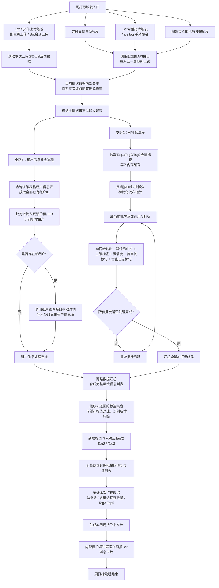

### 1. 周打标流程图

### 2. 周打标流程测试
### 周打标流程节点验收表

| 节点编号 | 节点名称 | 输入 | 输出 | 验证标准 |
| :--- | :--- | :--- | :--- | :--- |
| 1 | 打标任务触发 | 定时时间到达 / Excel文件上传 / Bot对话指令 / 配置页立即执行按钮点击 | 周打标任务正式启动 | 1. 定时任务按配置的周期准时触发 2. 配置页 / Bot会话上传Excel文件后，自动立即触发打标 3. Bot内输入 `/nps tag` 指令，可手动触发打标 4. 配置页点击「立即执行」按钮，可手动触发打标 |
| 2 | 数据源读取 | 触发方式、对应数据源配置参数 | 本批次原始反馈数据集 | 1. Excel上传触发：直接读取本次上传的文件数据，不调用API接口 2. 定时 / Bot指令 / 配置页按钮触发：调用配置的API接口，正确替换时间占位符，拉取对应周期数据 3. 读取的字段与反馈列表定义的字段映射一致 |
| 3 | 当前批次数据内部去重 | 本次读取的原始反馈数据 | 去重后的本批次反馈集 | 1. 仅对当前批次读取的数据做重复反馈ID过滤，不与历史反馈表比对 2. 去重后本批次内无重复的反馈ID 3. 去重前后数量差与实际重复数据量一致 |
| 4 | 支路1：租户信息补全 | 去重后的反馈集 | 更新后的租户信息表、租户ID映射关系 | 1. 完整读取多维表格租户信息表的全部已有租户ID，准确识别新增租户 2. 仅对新租户调用查询接口获取详情，写入租户信息表 3. 无新租户时，不调用接口、不修改租户信息表，直接完成该支路 4. 新租户写入后无重复条目，字段信息完整 |
| 5 | 支路2：标签拉取与分批AI打标 | 去重后的反馈集、标签体系表 | 全量打标结果集（含翻译文本、三级标签、置信度、标记位） | 1. 打标前一次性拉取Tag1/Tag2/Tag3全量标签，写入内存缓存 2. 反馈按50条/批拆分，不足50条按实际数量处理，逐批循环调用AI 3. AI同步输出：非中文反馈翻译为中文、三级标签匹配结果、置信度数值、待审核标记、需查日志标记 4. 置信度低于阈值或语义存疑的反馈，自动标记为「待审核」 5. 卡顿/白屏等技术类无法定位原因的反馈，自动标记为「需查日志」 6. 所有批次处理完成后，输出完整的打标结果集合 |
| 6 | 双支路数据汇总 | 租户补全结果、AI打标结果 | 完整的反馈信息列表 | 1. 租户信息与打标结果按反馈ID一一匹配，无错配、无遗漏 2. 每条反馈包含完整字段：租户信息、翻译后文本、三级标签、置信度、待审核标记、需查日志标记 |
| 7 | 新增标签识别与写入 | 汇总后的完整数据、内存标签缓存 | 更新后的Tag2/Tag3表 | 1. 准确识别AI打标结果中、标签体系内不存在的新增标签 2. 新增标签按层级写入对应Tag表，生成唯一tagId 3. 全部新增标签写入完成后，再执行反馈表回填操作 |
| 8 | 打标结果回填反馈表 | 完整反馈数据、最新标签表数据 | 更新后的反馈列表 | 1. 标签字段以关联形式写入反馈表，非纯文本存储 2. 租户信息、翻译后文本、置信度、待审核、需查日志、打标状态等字段同步写入 3. 批量写入无遗漏、无错行、无重复记录 |
| 9 | 打标数据统计 | 回填后的反馈数据 | 本次打标统计指标集 | 1. 准确统计本次打标总反馈条数 2. 准确统计各层级标签的产生数量与分布情况 3. 准确输出Tag3使用频次Top5标签，及对应次数、占比 |
| 10 | 周报文档生成 | 打标统计数据、Top问题数据 | 飞书周报文档 | 1. 文档标题包含周期标识（如2026年第XX周） 2. 文档内容包含：打标总数、标签分布、Tag3 Top5问题排行、评分分布 3. 每次打标新建独立文档，不覆盖历史文档 |
| 11 | Bot周报通知 | 周报核心数据、通知群配置 | 飞书群消息卡片 | 1. 卡片格式与PRD定义一致，包含拉取总数、待审核数、Top问题、评分分布 2. 「审核标签」按钮跳转至筛选后的待审核反馈列表 3. 本周期存在需查日志反馈时，显示「查看日志平台」按钮 4. 待审核数＞100时，显示红色警告提示 |

